<div align="center">

# 🩺 SehatSaathi AI (صحت ساتھی)
### *Your Personal AI Healthcare Companion — Hospital-Grade Intelligence for 230M+ People*

> **Empowering Pakistan & South Asia with Intelligent, Accessible, Bilingual Healthcare**

[](https://sehatsaathi-ai.vercel.app)
[](https://github.com/maryamtahir7/SehatSaathi-AI)
[](LICENSE)


<br/>

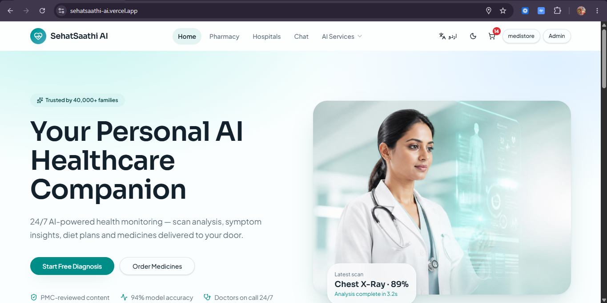

</div>

---

##  Table of Contents

- [Overview](#-overview)
- [Problem Statement](#-problem-statement)
- [Key Features & Modules](#-key-features--modules)
  - [Module 1: AI Medical Diagnostics](#module-1-ai-medical-diagnostics-diagnostics)
  - [Module 2: Symptom Checker & Disease Prediction](#module-2-symptom-checker--disease-prediction-symptoms)
  - [Module 3: Bilingual AI Health Consultant](#module-3-bilingual-ai-health-consultant-chat)
  - [Module 4: Edge Prescription OCR Scanner](#module-4-edge-prescription-ocr-scanner-prescription)
  - [Module 5: 15,000+ Medicine E-Store & Pharmacy](#module-5-15000-medicine-e-store--pharmacy-pharmacy)
  - [Module 6: Geo-Spatial Hospital Locator](#module-6-geo-spatial-hospital-locator-hospitals)
  - [Module 7: Nutritional Diet & BMR Planner](#module-7-nutritional-diet--bmr-planner-diet)
  - [Module 8: Operational Admin Dashboard](#module-8-operational-admin-dashboard-admin)
- [System Architecture & Diagrams](#-system-architecture--diagrams)
  - [4.1 System Architecture Overview](#41-system-architecture-overview)
  - [4.2 Medical Image Diagnostic Flow](#42-medical-image-analysis-flow)
  - [4.3 AI Chat & Pharmacy Linkage Flow](#43-ai-chat--pharmacy-linkage-flow)
  - [4.4 Prescription OCR Data Flow](#44-prescription-ocr-scanner-flow)
  - [Complete User Journey & ML Pipeline](#complete-user-journey--ml-pipeline)
- [Technology Stack](#-technology-stack)
- [Project Structure](#-project-structure)
- [Getting Started](#-getting-started)
- [Environment Variables](#-environment-variables)
- [API Reference](#-api-reference)
- [License](#-license)

---

##  Overview

**SehatSaathi AI** (*Sehat* = Health, *Saathi* = Companion in Urdu) is a production-deployed, full-stack, AI-native healthcare platform engineered to bridge the critical healthcare divide across Pakistan and South Asia.

By combining **custom-trained ONNX deep learning models**, **high-throughput Groq LLaMA 3.3-70B conversational AI (~500 tok/s)**, **100% private in-browser WebAssembly OCR**, **vectorized symptom classification**, and an **integrated e-pharmacy of 15,000+ medicines**, SehatSaathi AI delivers an end-to-end clinical companion that runs on any device, in both English and Urdu, completely free for the patient.

---

##  Problem Statement

<div align="center">
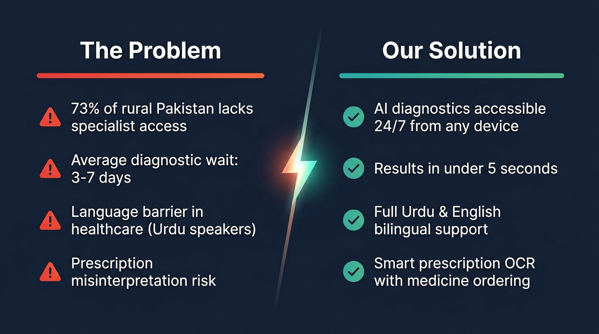
</div>

<br/>

| Challenge | Empirical Statistic | Real-World Impact |
|:---|:---|:---|
| **Catastrophic Doctor Shortage** | **1:1,085** ratio (WHO critical line: 1:600) | Chronic healthcare deficit and medical burnout |
| **Rural Specialist Exclusion** | **73%** of rural population excluded | 6–12 hour travels for basic consultations |
| **Diagnostic Delays** | **3 to 7 days** average imaging wait | Preventable diseases progress to acute stages |
| **Linguistic Alienation** | **75%+** speak Urdu; healthcare is English | Systematic exclusion of non-English speakers |
| **Prescription Handwriting Errors** | Misread daily by local pharmacies | Ineffective therapies and severe adverse drug events |
| **Prohibitive Private Fees** | **Rs. 2,000 – 10,000** per specialist visit | Severe financial burden on low- and middle-income families |

---

##  Key Features & Modules

### Module 1: AI Medical Diagnostics (`/diagnostics`)
Automated radiology triage accepting Brain MRI scans, Chest X-Rays, and Dermatology photos with sub-5-second clinical reports.

* **Auto-Modality Detection:** Analyzes mean pixel luminance (mean < 95 => Brain MRI; mean >= 95 => Chest X-Ray).
* **Brain MRI:** 4-class classification (**Glioma, Meningioma, Pituitary Tumor, Healthy**) via `braintumor.onnx`.
* **Chest X-Ray:** Binary classification (**Pneumonia vs Healthy Thorax**) via `lung.onnx`.
* **Skin Lesion Classifier:** Dermatology diagnosis across conditions via `skin.onnx`.

<div align="center">

| Brain MRI Analysis | Chest X-Ray Analysis | Dermatology / Skin |
|:---:|:---:|:---:|
| 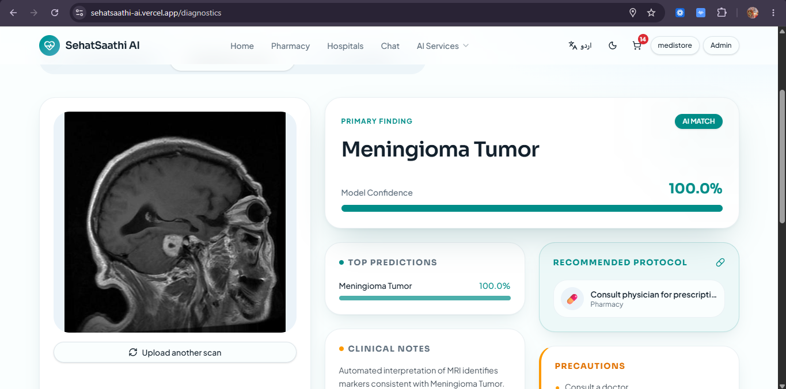 | 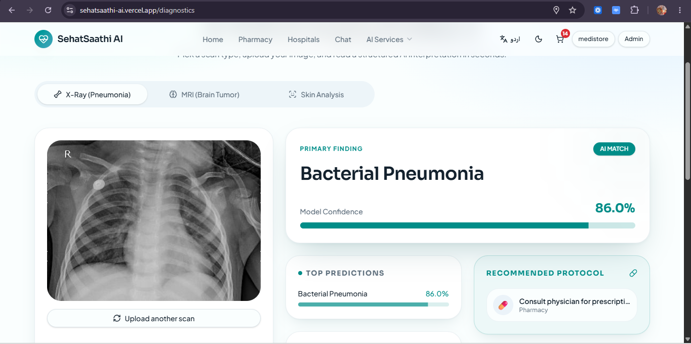 | 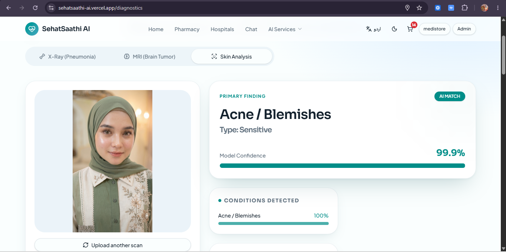 |

</div>

---

### Module 2: Symptom Checker & Disease Prediction (`/symptoms`)
Comprehensive clinical differential prediction based on 132 standardized symptoms.

* **132-Dimensional Vectorization:** Encodes user-selected symptoms into a sparse binary vector.
* **Support Vector Classifier (`svc.onnx`):** Predicts across **41 distinct diseases** (Malaria, Typhoid, Dengue, Diabetes, Hepatitis, etc.).
* **Holistic Recovery Protocols:** Queries 5 in-memory CSV datasets for descriptions, 4 precautions, medication classes, condition-specific diets, and workout recovery plans.

<div align="center">
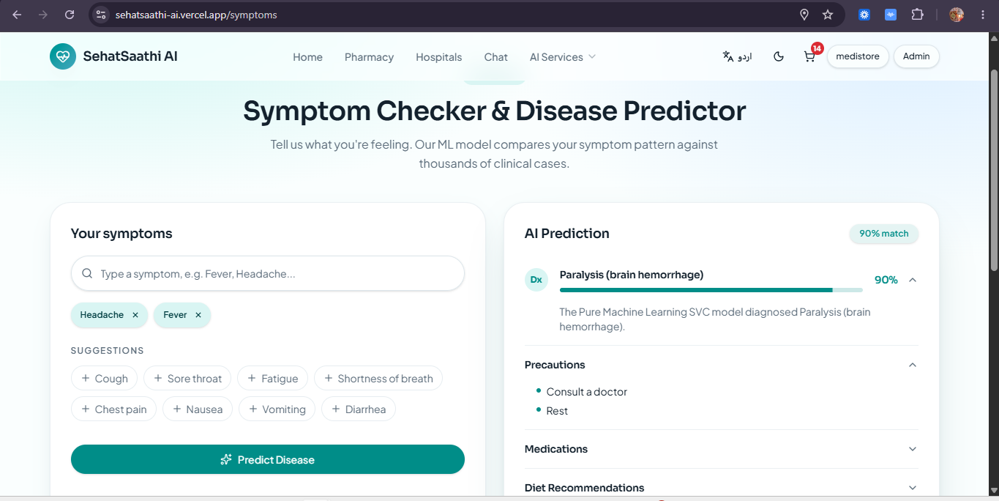
</div>

---

### Module 3: Bilingual AI Health Consultant (`/chat`)
Real-time conversational medical assistant running on Groq LPUs for sub-second, culturally nuanced healthcare support.

* **High-Throughput Inference:** Groq LLaMA 3.3-70B Versatile delivering **~500 tokens per second**.
* **Bilingual English & Urdu Support:** Fluent conversational guidance in both English and natural Urdu (*Nastaliq* & Roman Urdu).
* **Automated E-Commerce Linkage:** Scans clinical advice for OTC medications and displays interactive **Product Cards** with pricing and 1-click **Add to Cart** buttons.

<div align="center">
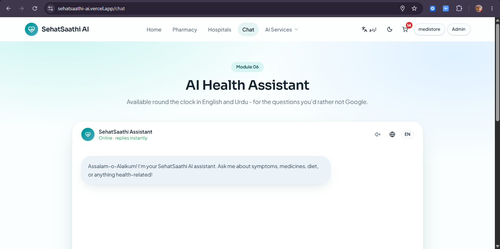
</div>

---

### Module 4: Edge Prescription OCR Scanner (`/prescription`)
Converts handwritten or printed paper doctor prescriptions into actionable digital shopping cart items.

* **100% In-Browser WASM:** Powered by `Tesseract.js` running in a dedicated Web Worker thread for zero server cost and complete HIPAA-level patient privacy.
* **Canvas Pre-Compression:** Downsamples scans to max 1200px at 0.8 JPEG quality to prevent Out-of-Memory (OOM) crashes on low-RAM mobile devices.
* **Resilient Cloud Fallback:** Transparently routes failed scans to an OCR.space cloud fallback.
* **Regex Clinical Parser:** Identifies dosage tokens (`Tab`, `Cap`, `Syp`, `Inj`, `mg`, `ml`, `OD`, `BD`, `TDS`) and capitalized brand names into an interactive editable table.

<div align="center">
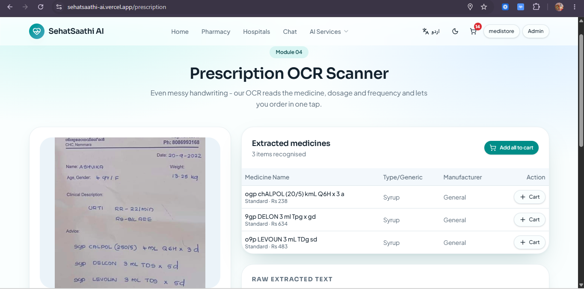
</div>

---

### Module 5: 15,000+ Medicine E-Store & Pharmacy (`/pharmacy`)
A production digital pharmacy catalog connecting diagnosis directly to treatment.

* **15,000+ Verified Medicines:** Real-world pharmaceutical dataset with transparent pricing, generic salt compositions, and manufacturer information.
* **Persistent Cart & Checkout:** State-managed shopping cart with full **Cash on Delivery (COD)** checkout support.

<div align="center">
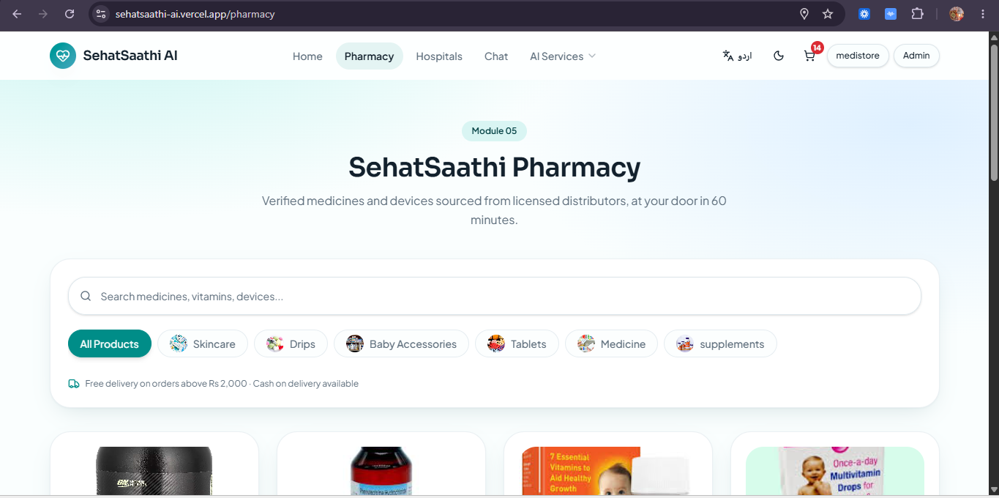
</div>

---

### Module 6: Geo-Spatial Hospital Locator (`/hospitals`)
Find nearby healthcare facilities with specialized filters across Pakistan.

* **OpenStreetMap & React Leaflet:** Zero-cost, privacy-friendly mapping without paid proprietary API dependencies.
* **City & Specialty Filters:** Quickly locate emergency rooms, diagnostic labs, and specialty hospitals.

<div align="center">
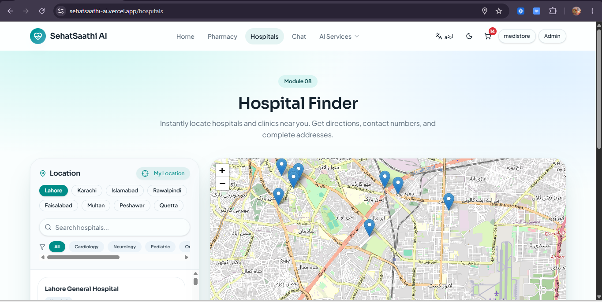
</div>

---

### Module 7: Nutritional Diet & BMR Planner (`/diet`)
Scientifically calibrated nutritional planning for preventative health and chronic condition management.

* **Metabolic Computation:** Computes Basal Metabolic Rate (BMR) and Total Daily Energy Expenditure (TDEE).
* **Disease-Specific Meal Plans:** Tailored dietary plans for diabetes, hypertension, renal conditions, and weight management.

<div align="center">
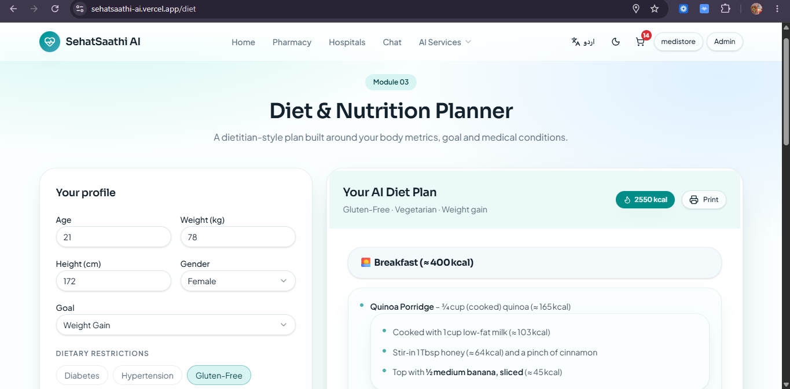
</div>

---

### Module 8: Operational Admin Dashboard (`/admin`)
Enterprise administrative dashboard for healthcare platform management and telemetry.

* **Live Business Telemetry:** Real-time revenue tracking, order volume, and order status fulfillment.
* **AI Model Metrics:** Tracks diagnostic inference distribution, user satisfaction ratings, and catalog inventory.

<div align="center">

| Admin Analytics Overview | Catalog Management: Add Product | Inventory: Add Category |
|:---:|:---:|:---:|
| 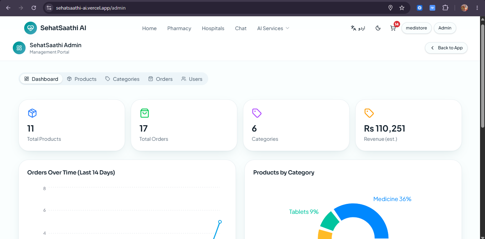 | 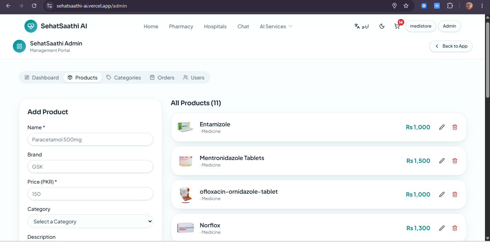 | 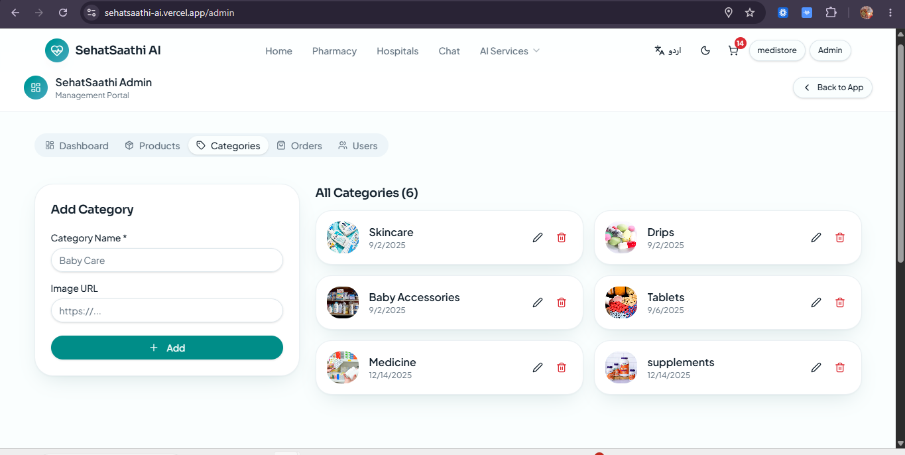 |

</div>

---

##  System Architecture & Diagrams

SehatSaathi AI implements a modern **Three-Tier Hybrid Serverless + Micro-Services Architecture**:

### 4.1 System Architecture Overview

<div align="center">
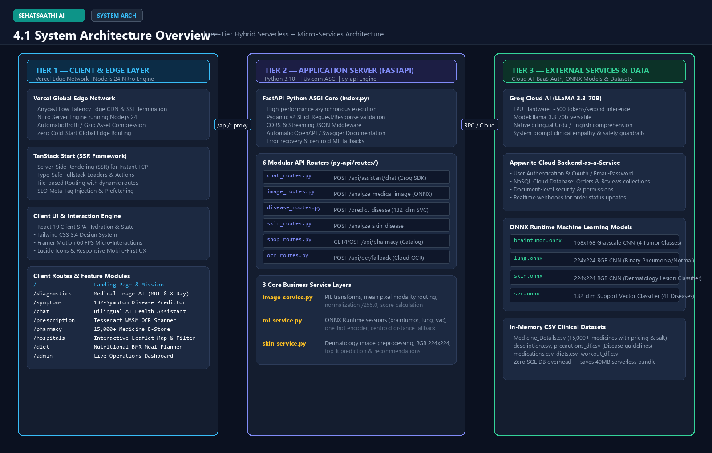
</div>

<br/>

<div align="center">
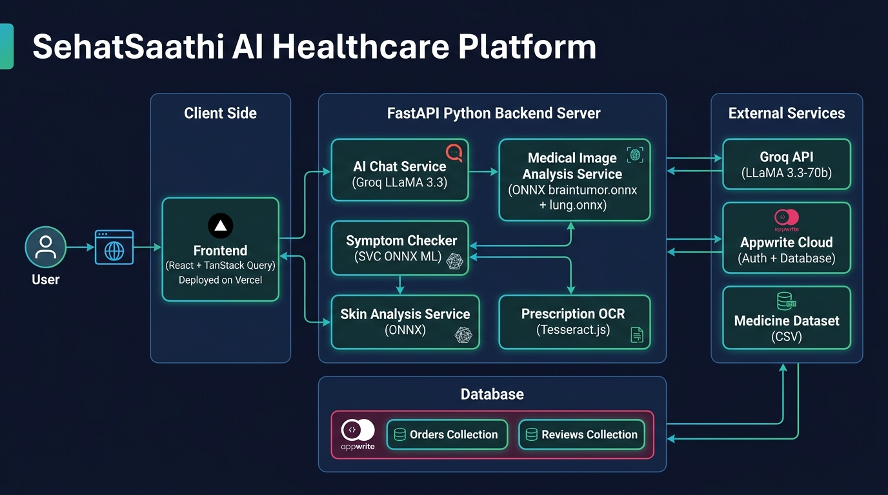
</div>

---

### 4.2 Medical Image Analysis Flow

<div align="center">
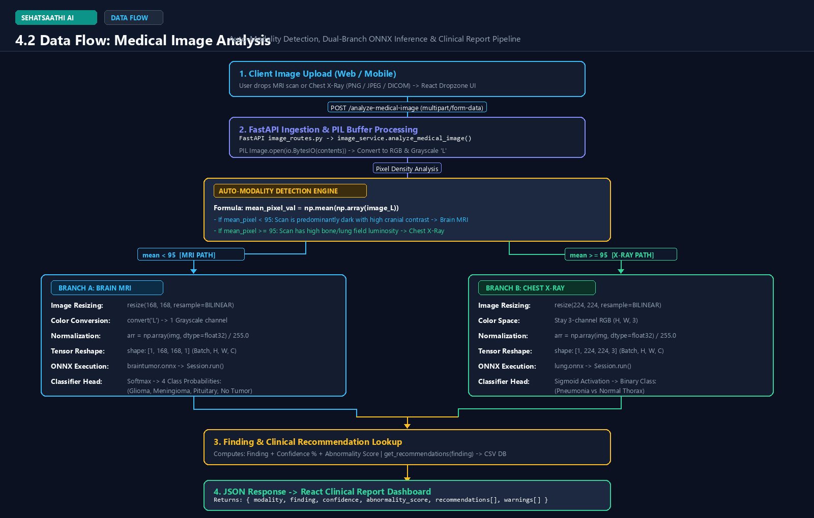
</div>

---

### 4.3 AI Chat & Pharmacy Linkage Flow

<div align="center">
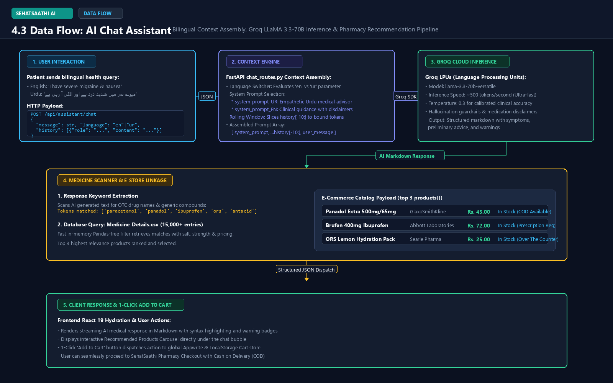
</div>

---

### 4.4 Prescription OCR Scanner Flow

<div align="center">
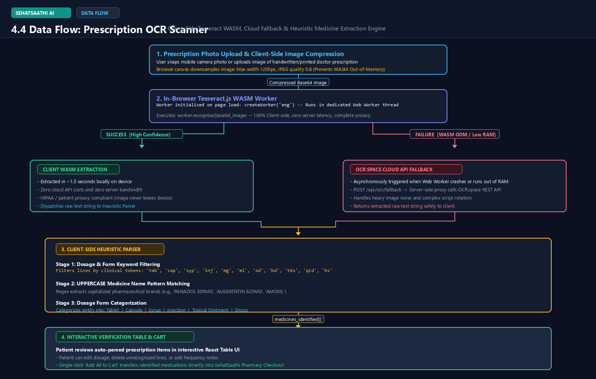
</div>

---

### Complete User Journey & ML Pipeline

<div align="center">

| End-to-End User Journey | Full ML Pipeline Deep Dive |
|:---:|:---:|
| 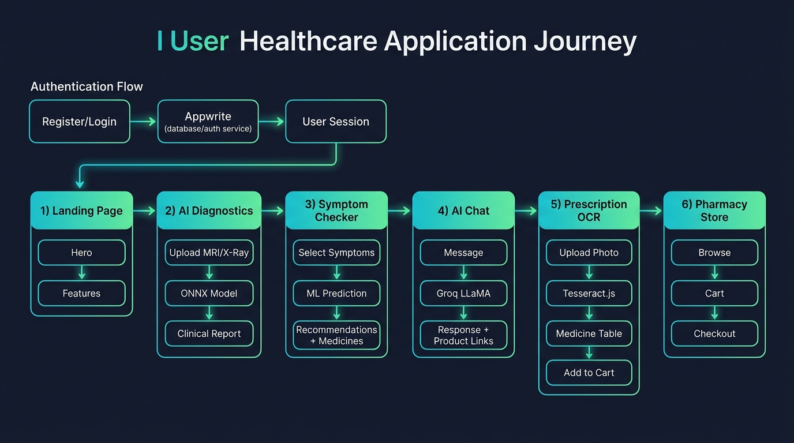 | 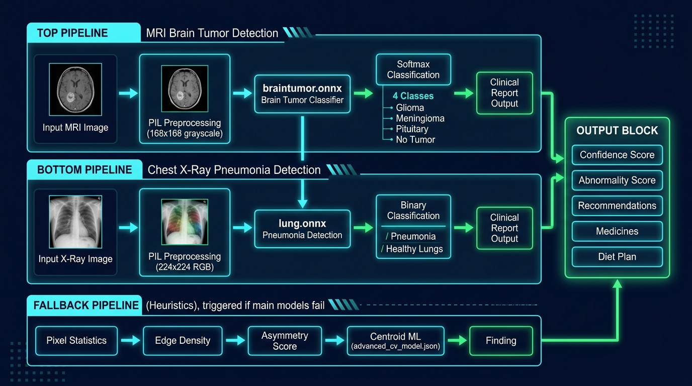 |

</div>

---

##  Technology Stack

<div align="center">
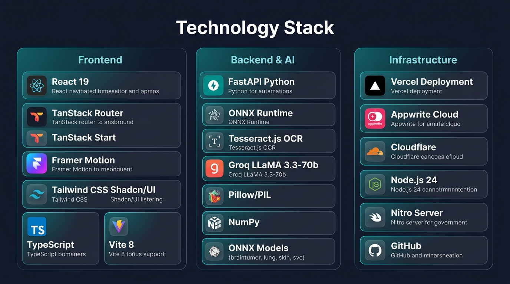
</div>

<br/>

### Frontend Client Layer (Tier 1)
| Component | Technology | Version | Purpose |
|:---|:---|:---|:---|
| **UI Framework** | React | 19.x | High-performance SPA with concurrent rendering |
| **Meta-Framework** | TanStack Start | Latest | Type-safe SSR powered by Nitro engine on Node.js 24 |
| **Styling** | Tailwind CSS | 3.4 / 4.x | Modern, responsive medical design system |
| **Motion** | Framer Motion | Latest | 60 FPS fluid micro-interactions and transitions |
| **Icons** | Lucide React | Latest | Crisp, accessible clinical icons |
| **Mapping** | React Leaflet | Latest | OpenStreetMap geo-spatial hospital locator |
| **In-Browser OCR** | Tesseract.js | 7.x | 100% private, client-side WebAssembly prescription OCR |

### Backend Application Server (Tier 2)
| Component | Technology | Purpose |
|:---|:---|:---|
| **API Framework** | FastAPI (Python 3.10+) | High-throughput asynchronous ASGI web server |
| **Server Runtime** | Uvicorn | Lightning-fast ASGI production server |
| **Data Validation** | Pydantic v2 | Strict JSON schema parsing and type validation |
| **Image Preprocessing** | Pillow (PIL) + NumPy | Modality detection, array reshaping, and normalization |

### External Services & Machine Learning (Tier 3)
| Model / Service | Technology | Specs | Task |
|:---|:---|:---|:---|
| **Conversational LLM** | Groq Cloud AI | LLaMA 3.3-70B (~500 tok/s) | Bilingual EN/UR health consulting & OTC mapping |
| **Brain MRI Model** | ONNX Runtime | `braintumor.onnx` (168x168x1) | 4-class tumor classification (Glioma/Meningioma/etc.) |
| **Chest X-Ray Model** | ONNX Runtime | `lung.onnx` (224x224x3) | Binary pneumonia detection vs normal thorax |
| **Dermatology Model** | ONNX Runtime | `skin.onnx` (224x224x3) | Skin condition & lesion classification |
| **Symptom Classifier** | ONNX Runtime | `svc.onnx` (132-dim vector) | 41-disease clinical differential diagnosis |
| **Backend-as-a-Service** | Appwrite Cloud | REST / WebSockets | User Authentication, Orders & Reviews NoSQL database |
| **Dataset Hydration** | In-Memory CSV | 15,000+ medicine rows | Zero-SQL, pandas-free high-speed catalog lookup |

---

##  Project Structure

```
SehatSaathi-AI/
├── frontend/                        # Full-stack React app (TanStack Start)
│   ├── src/
│   │   ├── routes/                  # File-based routing
│   │   │   ├── __root.tsx           # App layout, navbar, footer, providers
│   │   │   ├── index.tsx            # Landing page
│   │   │   ├── diagnostics.tsx      # Multi-modal medical imaging AI
│   │   │   ├── symptoms.tsx         # 132-symptom disease checker
│   │   │   ├── chat.tsx             # Bilingual AI medical assistant
│   │   │   ├── prescription.tsx     # Tesseract WASM prescription OCR
│   │   │   ├── pharmacy.tsx         # 15,000+ medicine catalog & cart
│   │   │   ├── hospitals.tsx        # Interactive hospital locator map
│   │   │   ├── diet.tsx             # BMR nutritional diet planner
│   │   │   └── admin.tsx            # Operations & analytics dashboard
│   │   ├── components/ui/           # Accessible UI design components
│   │   └── lib/                     # Global state, Appwrite client, i18n
│   └── py-api/                      # FastAPI Python backend
│       ├── index.py                 # ASGI application entry point
│       ├── routes/                  # 6 Modular API route handlers
│       │   ├── chat_routes.py       # Groq LLaMA 3.3-70B bridge
│       │   ├── image_routes.py      # Multipart upload & modality routing
│       │   ├── disease_routes.py    # 132-symptom vectorization
│       │   ├── skin_routes.py       # Dermatology image inference
│       │   ├── shop_routes.py       # Pharmacy product querying
│       │   └── ocr_routes.py        # Cloud OCR fallback handler
│       ├── services/                # Core business services
│       │   ├── image_service.py     # PIL transforms & scoring
│       │   ├── ml_service.py        # ONNX sessions & vectorizer
│       │   └── skin_service.py      # Lesion preprocessing
│       ├── models/                  # Production .onnx model weights
│       └── dataset/                 # Clinical CSV knowledge bases
├── docs/                            # Comprehensive documentation & figures
│   ├── images/                      # High-res architecture diagrams (PNG)
│   ├── screenshots/                 # Complete UI screenshots
│   └── PROJECT_DOCUMENTATION.md     # Full technical documentation
└── README.md
```

---

##  Getting Started

### Prerequisites
* **Node.js**: v20.x or v22.x+
* **Python**: v3.10 or v3.11+
* **Package Manager**: npm v10+

### 1. Clone the Repository
```bash
git clone https://github.com/maryamtahir7/SehatSaathi-AI.git
cd SehatSaathi-AI
```

### 2. Environment Configuration
Create a `.env.local` inside `frontend/py-api/`:
```bash
cp .env.example frontend/py-api/.env.local
```
Add your API credentials:
```env
GROQ_API_KEY=gsk_your_groq_api_key_here
GROQ_MODEL=llama-3.3-70b-versatile
APPWRITE_ENDPOINT=https://cloud.appwrite.io/v1
APPWRITE_PROJECT_ID=your_project_id
```

### 3. Install Dependencies
```bash
# Frontend dependencies
cd frontend
npm install

# Python backend dependencies
cd py-api
pip install fastapi uvicorn pillow onnxruntime numpy python-dotenv groq
```

### 4. Run Locally
**Terminal 1: Start Python Backend Server**
```bash
cd frontend/py-api
uvicorn index:app --reload --port 8000
```

**Terminal 2: Start TanStack Start Dev Server**
```bash
cd frontend
npm run dev
```
Open **http://localhost:3000** in your browser.

---

##  API Reference

| Method | Endpoint | Description | Payload / Params |
|:---|:---|:---|:---|
| `POST` | `/analyze-medical-image` | Auto-detects modality and runs Brain MRI / Chest X-Ray ONNX | `multipart/form-data` (`file`) |
| `POST` | `/predict-disease` | Vectorizes 132 symptoms and runs `svc.onnx` classifier | `{"symptoms": ["headache", "fever"]}` |
| `POST` | `/api/assistant/chat` | Groq LLaMA 3.3-70B bilingual consultation with medicine extraction | `{"message": str, "language": "en"|"ur", "history": []}` |
| `POST` | `/analyze-skin-disease` | Classifies dermatology photos via `skin.onnx` | `multipart/form-data` (`file`) |
| `GET` | `/api/pharmacy` | Queries 15,000+ medicine catalog with category filters | `?query=panadol&category=pain` |
| `POST` | `/api/ocr/fallback` | Cloud fallback for prescription transcription | `{"image": "base64_string"}` |

---

##  License

This project is licensed under the **MIT License** — see the [LICENSE](LICENSE) file for details.

---

<div align="center">
<strong>Built with ❤️ for Pakistan & South Asia 🇵🇰</strong>
<br/>
<em>SehatSaathi AI — Democratizing Hospital-Grade Healthcare for Everyone.</em>
</div>
