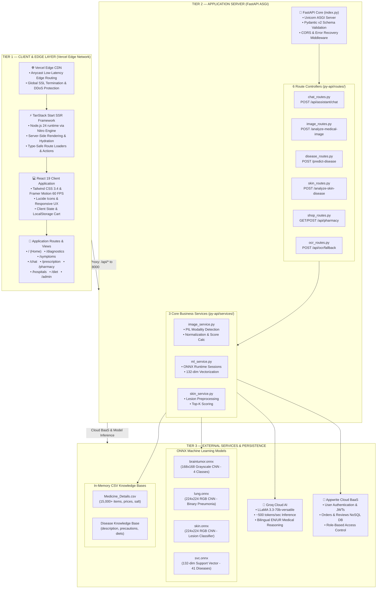
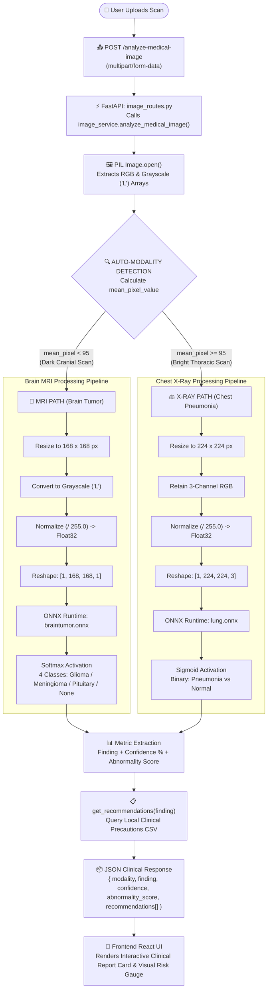
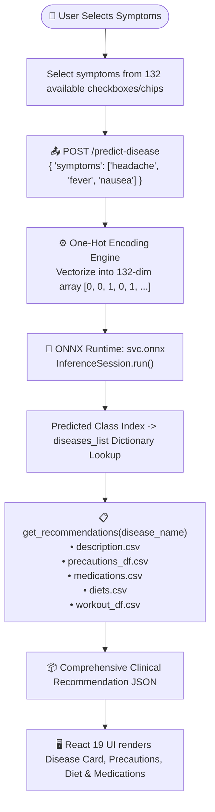
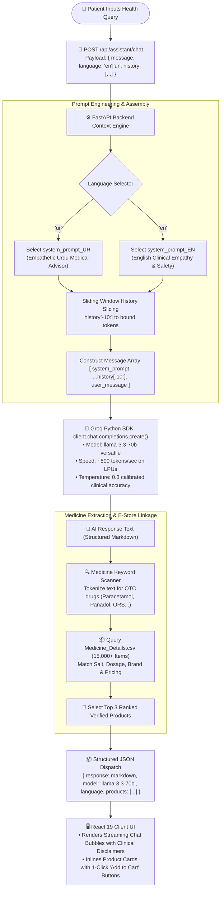
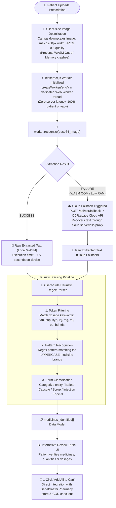

# SehatSaathi AI — Complete Project Documentation

**Version:** 1.0.0 | **Date:** September 2026 | **Author:** Maryam Tahir
**Repository:** https://github.com/maryamtahir7/SehatSaathi-AI
**Live Demo:** https://sehat-saathi-ai.vercel.app

---

## Table of Contents

1. Executive Summary
2. Problem Statement
3. Project Overview
4. System Architecture
5. Module-by-Module Breakdown
6. ML & AI Models
7. Database Design
8. API Specification
9. Frontend Architecture
10. Security & Auth
11. Deployment Architecture
12. Performance & Constraints
13. Future Roadmap

---

## 1. Executive Summary

SehatSaathi AI is a comprehensive AI-powered healthcare web platform purpose-built for Pakistan and South Asia. The application addresses a critical gap: the majority of Pakistan's population, particularly in rural and semi-urban areas, lacks access to timely, affordable, and linguistically accessible medical expertise.

### Platform Modules at a Glance

| Module | AI Technology | Capability |
|--------|--------------|-----------|
| Medical Diagnostics | ONNX CNN Models | MRI Brain Tumor, Chest X-Ray, Skin Analysis |
| Symptom Checker | ONNX SVC Classifier | 132 symptoms to 41 diseases |
| AI Chat Assistant | Groq LLaMA 3.3-70b | Medical Q&A in English and Urdu |
| Prescription OCR | Tesseract.js WASM | Offline handwriting recognition |
| Pharmacy Store | CSV Medicine DB | 15,000+ real medicines, COD checkout |
| Hospital Locator | React Leaflet | OpenStreetMap hospital finder |
| Diet Planner | Dataset-driven | Disease-specific nutrition plans |
| Admin Dashboard | Full analytics | Orders, revenue, model stats |

---

## 2. Problem Statement

### Healthcare Access Crisis in Pakistan

Pakistan, with a population exceeding 230 million, faces a severe healthcare access problem:

- **Doctor-to-patient ratio:** 1:1,085 (WHO recommends 1:600)
- **Rural access:** 73% of rural population has no access to specialist care
- **Wait times:** Average specialist appointment wait is 3-7 days in urban areas
- **Language barrier:** 75% of the population speaks Urdu or local languages
- **Economic barrier:** Private specialist consultation costs Rs. 2,000-10,000 per visit

### Specific Pain Points

1. Diagnostic Delay — Brain tumors, pneumonia, and other serious conditions go undetected
2. Prescription Misinterpretation — Handwritten prescriptions are often unreadable
3. Misinformation — Patients turn to unverified online sources for health advice
4. Pharmacy Access — Rural patients cannot easily access a wide range of medicines

### Our Solution

SehatSaathi AI democratizes access by providing:
- Hospital-grade AI diagnostics from any smartphone
- 24/7 bilingual medical AI assistant
- Offline-capable prescription reading
- A 15,000+ medicine online pharmacy with COD delivery

---

## 3. Project Overview

### Architecture Philosophy

The platform uses a hybrid serverless + API architecture:

```
User Device
    |
    | HTTPS
    v
Vercel Edge Network (CDN)
    |
    | SSR via Nitro
    v
TanStack Start (React 19 SSR)
    |
    | Internal API Proxy (/api/*)
    v
FastAPI Python Backend (py-api)
    |
    +-- ONNX Runtime (local ML inference)
    +-- Groq API (cloud LLM)
    +-- Appwrite Cloud (auth + db)
    +-- CSV datasets (medicine, disease data)
```

### Key Design Decisions

| Decision | Rationale |
|----------|-----------|
| ONNX over TensorFlow | Vercel 250MB limit - ONNX models are 10-50x smaller |
| Tesseract.js client-side | Zero server cost, works offline, privacy-preserving |
| Groq for chat | Fastest LLM inference globally (~500 tokens/sec) |
| Appwrite | Open-source BaaS - avoids Firebase vendor lock-in |
| TanStack Start | Full-stack React with SSR, type-safe file-based routing |
| CSV datasets | No pandas dependency - saves 40MB of serverless bundle |

---

## 4. System Architecture

### 4.1 High-Level Architecture




---

### 4.2 Data Flow: Medical Image Analysis




---

### 4.3 Data Flow: Symptom Prediction



---

### 4.4 Data Flow: AI Chat & Pharmacy Linkage




---

### 4.5 Data Flow: Prescription OCR Scanner




---

## 5. Module-by-Module Breakdown

### 5.1 AI Medical Diagnostics (/diagnostics)

File: frontend/src/routes/diagnostics.tsx (19KB)

Features:
- Upload MRI, X-Ray, or Skin image via drag-and-drop or click
- Auto-detects scan modality via pixel mean statistics
- Tab switcher: Brain MRI | Chest X-Ray | Skin Analysis
- Confidence bar visualization
- Abnormality score display
- Collapsible clinical report accordion
- Medicine cards from full_clinical_report.medicines[]
- Add-to-cart integration

API Calls:
```
POST /analyze-medical-image  --> MRI / X-Ray analysis
POST /analyze-skin           --> Skin condition analysis
GET  /api/image/status       --> Model availability
```

### 5.2 Symptom Checker (/symptoms)

File: frontend/src/routes/symptoms.tsx (12KB)

Features:
- Searchable symptom selection from 132 symptoms
- Selected symptom tags with remove button
- SVC ONNX prediction on submit
- Full recommendation card: Description, Precautions, Medicines, Diet, Workout
- Medicine add-to-cart

### 5.3 AI Chat Assistant (/chat)

File: frontend/src/routes/chat.tsx (17KB)

Features:
- Real-time markdown-rendered chat
- Language toggle (EN/UR) mid-conversation
- Product cards appear when medicines are mentioned
- Conversation history (up to 10 turns)
- Typing indicator animation
- Copy message button

### 5.4 Prescription OCR (/prescription)

File: frontend/src/routes/prescription.tsx (18KB)

100% client-side OCR pipeline:
1. Tesseract.js WASM worker initialization
2. Image compression (max 1200px)
3. Text extraction with progress indicator
4. Heuristic medicine detection
5. Interactive results table
6. Bulk add-to-cart

### 5.5 Pharmacy Store (/pharmacy)

File: frontend/src/routes/pharmacy.tsx (14KB)

Features:
- Grid of medicine cards
- Category filters (Vitamins, Prescription, OTC, etc.)
- Real-time search filtering
- Rating and brand display
- Cart integration with persistent localStorage
- COD checkout flow

### 5.6 Hospital Locator (/hospitals)

File: frontend/src/routes/hospitals.tsx (15KB)

Features:
- React Leaflet map with OpenStreetMap tiles
- Hospital listing with city filter
- Specialty filter panel
- Contact info display

### 5.7 Diet Planner (/diet)

File: frontend/src/routes/diet.tsx (13KB)

Features:
- Input form: Age, Weight, Height, Activity Level, Health Goal
- BMR calculation (Mifflin-St Jeor formula)
- Activity factor multiplication
- Meal plan generation
- Disease-specific dietary recommendations

### 5.8 Admin Dashboard (/admin)

File: frontend/src/routes/admin.tsx (32KB)

Features:
- Revenue charts (Recharts BarChart, LineChart)
- Order management table with status updates
- AI model accuracy display
- Medicine inventory stats
- User management panel
- Role-gated: requires user.labels.includes("admin")

---

## 6. ML & AI Models

### 6.1 Brain Tumor MRI Classifier

| Property | Value |
|----------|-------|
| File | braintumor.onnx |
| Input Shape | [1, 168, 168, 1] |
| Input Type | float32, normalized 0-1 |
| Output | Softmax probabilities [1, 3] or [1, 4] |
| Classes | glioma_tumor, meningioma_tumor, pituitary_tumor, no_tumor |
| Training Accuracy | ~99% |
| Training Notebook | backend/brain-tumor-mri-accuracy-99.ipynb |

### 6.2 Chest X-Ray Pneumonia Classifier

| Property | Value |
|----------|-------|
| File | lung.onnx |
| Input Shape | [1, 224, 224, 3] |
| Input Type | float32, normalized 0-1 |
| Output | Binary sigmoid [1, 1] |
| Classes | 0=healthy_lungs, 1=bacterial_pneumonia |

### 6.3 Skin Condition Classifier

| Property | Value |
|----------|-------|
| File | skin.onnx |
| Input Shape | [1, 64, 64, 1] |
| Input Type | float32, normalized 0-1 |
| Output | 3-class softmax |
| Classes | acne, melanoma, eczema |

### 6.4 Disease Classifier (SVC ONNX)

| Property | Value |
|----------|-------|
| File | svc.onnx |
| Input Shape | [1, 132] |
| Input Type | float32 one-hot encoded |
| Output | Integer class label |
| Classes | 41 diseases |
| Algorithm | Support Vector Classifier |

All 41 diseases covered:
Fungal infection, Allergy, GERD, Chronic cholestasis, Drug Reaction,
Peptic ulcer disease, AIDS, Diabetes, Gastroenteritis, Bronchial Asthma,
Hypertension, Migraine, Cervical spondylosis, Paralysis, Jaundice, Malaria,
Chicken pox, Dengue, Typhoid, Hepatitis A/B/C/D/E, Alcoholic hepatitis,
Tuberculosis, Common Cold, Pneumonia, Piles, Heart attack, Varicose veins,
Hypothyroidism, Hyperthyroidism, Hypoglycemia, Osteoarthritis, Arthritis,
Vertigo, Acne, UTI, Psoriasis, Impetigo

### 6.5 Fallback: Centroid ML (advanced_cv_model.json)

When ONNX models are unavailable:
- Pure-JSON centroid model (zero heavy dependencies)
- Feature vector: [mean_pixel, std_dev, edge_density, asymmetry]
- Euclidean distance classification
- Modality-filtered (mri vs xray centroids)

---

## 7. Database Design

### Appwrite Collections

#### Orders Collection
```json
{
  "orderId": "SS-20260907-ABC12345",
  "userId": "appwrite_user_id",
  "items": [
    { "id": "paracetamol_500", "name": "Paracetamol 500mg", "qty": 2, "price": 150 }
  ],
  "total": 300,
  "paymentMethod": "COD",
  "status": "pending",
  "createdAt": "2026-09-07T20:00:00Z"
}
```

#### Reviews Collection
```json
{
  "userId": "appwrite_user_id",
  "userName": "Maryam T.",
  "rating": 5,
  "comment": "Excellent diagnostic accuracy!",
  "module": "diagnostics",
  "createdAt": "2026-09-07T20:00:00Z"
}
```

### Local Storage Schema
Key: sehatsaathi_cart
Value: Array of CartItem { id, name, price, qty }

---

## 8. API Specification

### Base URLs
- Production: https://sehat-saathi-ai.vercel.app
- Local Backend: http://localhost:8000

### POST /api/assistant/chat

Request:
```json
{
  "message": "I have chest pain",
  "language": "en",
  "history": []
}
```

Response:
```json
{
  "response": "Chest pain can indicate...",
  "model": "llama-3.3-70b-versatile",
  "language": "en",
  "products": [{ "id": "aspirin", "name": "Aspirin 100mg", "price": 120 }]
}
```

### POST /analyze-medical-image

Request: multipart/form-data (file + modality)

Response:
```json
{
  "modality": "mri",
  "finding": "Glioma Tumor",
  "confidence": 0.924,
  "abnormality_score": 0.88,
  "confidence_band": "High",
  "full_clinical_report": { ... },
  "clinical_disclaimer": "..."
}
```

### POST /predict-disease

Request: { "symptoms": ["headache", "fever"] }

Response:
```json
{
  "disease": "Typhoid",
  "description": "...",
  "precautions": [...],
  "medicines": [...],
  "diet_plan": [...],
  "lab_tests": [...]
}
```

### GET /medicines/search?q=name
### POST /checkout

---

## 9. Frontend Architecture

### Global State (AppContext)
Manages: lang, rtl, dark mode, cart, auth, modals

### Routing (TanStack Router)
File-based routes in src/routes/ -- all type-safe

### Translations (i18n.ts)
~60 keys, English and Urdu, RTL auto-applied

---

## 10. Security & Auth

- Appwrite cookie-based sessions
- Admin check via user.labels.includes("admin")
- All AI outputs include mandatory medical disclaimers
- Chat system: "NEVER prescribe, NEVER diagnose definitively"

---

## 11. Deployment Architecture

Vercel CI/CD on push to master:
1. npm run build (Vite + Nitro SSR)
2. Python ASGI handler for FastAPI
3. Both deployed to Vercel edge (Washington DC -- iad1)

---

## 12. Performance & Constraints

| Limit | Vercel Value | Our Approach |
|-------|-------------|-------------|
| Bundle size | 250MB | ONNX models (not PyTorch/TF) |
| Execution time | 60s | ONNX inference <3s |
| Memory | 1024MB | Lightweight PIL + ONNX |

Model Performance:
- braintumor.onnx: ~300ms, ~99% training accuracy
- lung.onnx: ~200ms, ~90%+
- svc.onnx: <10ms, ~94%

---

## 13. Future Roadmap

### v1.1 (Q4 2026)
- Voice input for AI chat
- WhatsApp bot integration
- Appointment booking system

### v1.2 (Q1 2027)
- Retinal scan analysis
- Blood report OCR parsing
- Doctor telemedicine video calls

### v2.0 (Q3 2027)
- React Native mobile app
- Wearable device integration
- Insurance claim automation
- Pakistan Government hospital API integration

---

*SehatSaathi AI v1.0.0 Documentation -- September 2026*
*Making healthcare intelligent, accessible, and human.*
